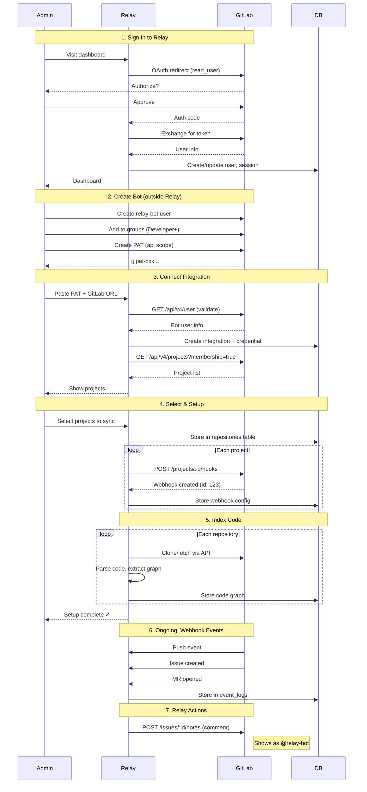
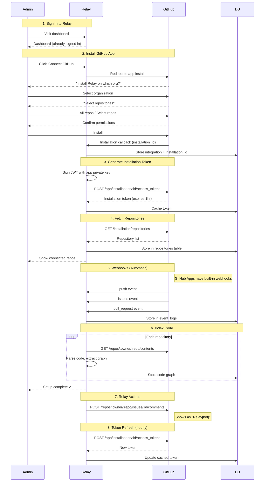
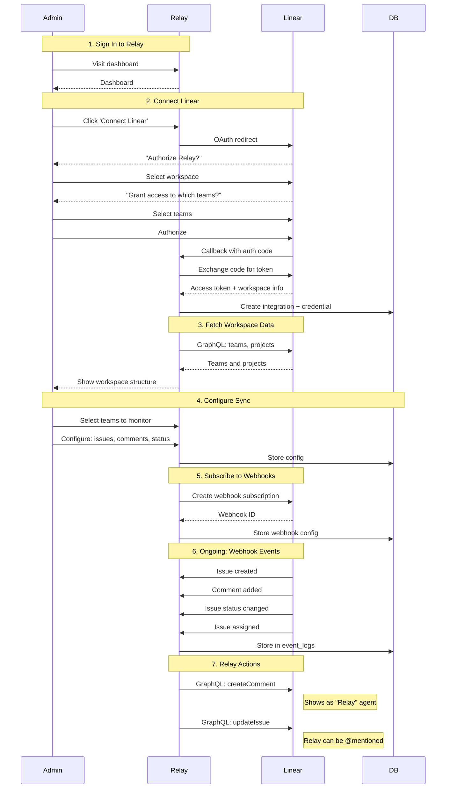
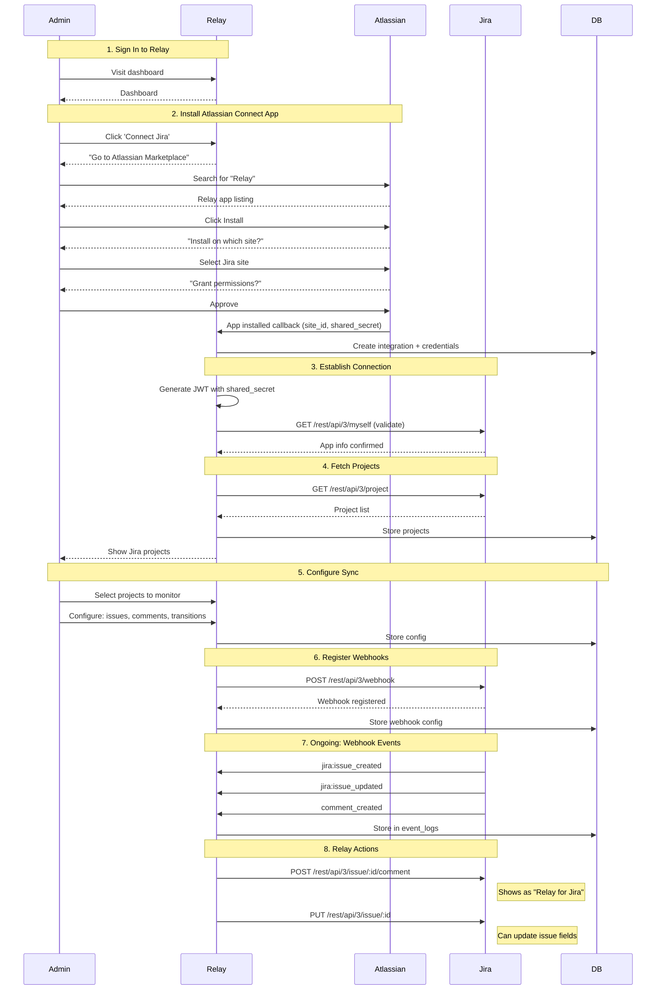
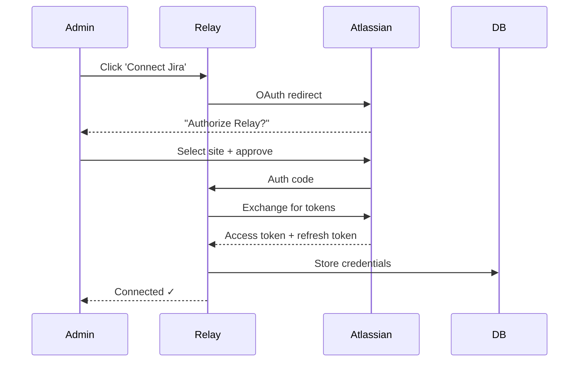
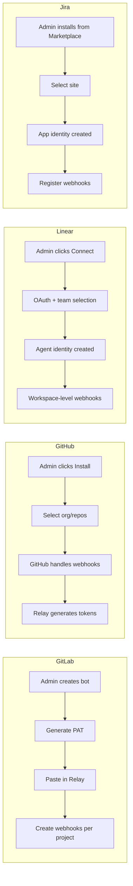

# Integration Flows

This document describes the onboarding and integration flows for each supported provider.

## Overview

| Provider | Auth Method | Identity | Entities Synced |
|----------|-------------|----------|-----------------|
| GitLab | PAT (Service Account) | Bot user | Repositories |
| GitHub | GitHub App | App installation | Repositories |
| Linear | OAuth / Agent Install | Relay Agent | Issues, Projects |
| Jira | Atlassian Connect | App | Issues, Projects |

---

## GitLab Integration

GitLab uses a PAT-based flow with a service account. Admin creates a bot user in GitLab and provides its access token.



### Credential Storage

| Field | Value |
|-------|-------|
| `credential_type` | `personal_access_token` |
| `user_id` | `null` (bot token) |
| `scopes` | `['api']` |

---

## GitHub Integration

GitHub uses GitHub Apps - the recommended integration method. Admin installs the Relay app on their organization.



### Credential Storage

| Field | Value |
|-------|-------|
| `credential_type` | `app_installation` |
| `user_id` | `null` |
| `access_token` | Installation token (cached, refreshed hourly) |
| `scopes` | Defined by app permissions |

### GitHub App Setup (One-time, Relay Admin)

1. Create GitHub App in Relay's GitHub account
2. Configure permissions: `contents: read`, `issues: write`, `pull_requests: write`, `webhooks: read`
3. Store app private key securely (not in DB)
4. App ID and private key used to generate installation tokens

---

## Linear Integration

Linear uses OAuth with an Agent model. The installed agent becomes a first-class participant in the workspace.



### Credential Storage

| Field | Value |
|-------|-------|
| `credential_type` | `app_installation` or `oauth` |
| `user_id` | `null` |
| `access_token` | OAuth token |
| `refresh_token` | If provided |
| `scopes` | `['read', 'write', 'issues:create', ...]` |

### Linear Agent Capabilities

- Can be @mentioned in issues and comments
- Can be assigned issues
- Actions attributed to "Relay" (not a person)
- Appears in workspace member list as an agent

---

## Jira Integration

Jira uses Atlassian Connect apps or OAuth 2.0 (3LO). Connect apps are recommended for deeper integration.



### Alternative: OAuth 2.0 (3LO)

For simpler integrations without Marketplace listing:



### Credential Storage

**Connect App:**
| Field | Value |
|-------|-------|
| `credential_type` | `app_installation` |
| `user_id` | `null` |
| `access_token` | Shared secret (for JWT signing) |

**OAuth 2.0 (3LO):**
| Field | Value |
|-------|-------|
| `credential_type` | `oauth` |
| `user_id` | `null` |
| `access_token` | OAuth access token |
| `refresh_token` | OAuth refresh token |

---

## Comparison Summary



| Aspect | GitLab | GitHub | Linear | Jira |
|--------|--------|--------|--------|------|
| **Setup steps** | 4 (create bot, PAT, paste, select) | 2 (install, select repos) | 2 (OAuth, select teams) | 2 (install, select projects) |
| **Token management** | Manual (PAT doesn't expire or has long expiry) | Automatic (hourly refresh) | OAuth refresh | Connect: JWT / OAuth: refresh |
| **Webhook setup** | Manual per-project | Automatic | Workspace-level | Manual registration |
| **Bot identity** | You create it | GitHub creates it | Linear creates it | Atlassian creates it |
| **Enterprise tier required** | No (PAT) / Yes (Group Token) | No | No | No |

---

## Database Schema Mapping

All integrations use the same schema:

```sql
-- integrations table
integration.provider            -- 'gitlab', 'github', 'linear', 'jira', 'slack', 'notion'
integration.capabilities        -- text[] e.g., {'code_repo', 'issue_tracker', 'wiki'}
integration.setup_by_user_id    -- Relay admin who configured it
integration.external_org_id     -- GitLab group, GitHub org, Linear workspace, Jira site

-- integration_credentials table
credential.credential_type      -- 'personal_access_token', 'app_installation', 'oauth'
credential.user_id              -- null for all (bot/app tokens)
credential.access_token         -- PAT, installation token, OAuth token, or shared secret
credential.refresh_token        -- For OAuth flows
credential.scopes               -- Granted permissions
```

### Capabilities

Providers can have multiple capabilities (e.g., GitLab is both code_repo and issue_tracker):

| Capability | Providers | Description |
|------------|-----------|-------------|
| `code_repo` | GitLab, GitHub | Source code, MRs/PRs, code reviews |
| `issue_tracker` | GitLab, GitHub, Linear, Jira | Issues, projects, sprints |
| `documentation` | Notion | Docs, knowledge base |
| `wiki` | GitLab, GitHub, Notion | Wiki pages |
| `communication` | Slack | Messages, threads, channels |

### Provider Capabilities

| Provider | Capabilities |
|----------|-------------|
| GitLab | `code_repo`, `issue_tracker`, `wiki` |
| GitHub | `code_repo`, `issue_tracker`, `wiki` |
| Linear | `issue_tracker` |
| Jira | `issue_tracker` |
| Slack | `communication` |
| Notion | `documentation`, `wiki` |

---

## Security Considerations

1. **Token storage**: All tokens encrypted at rest
2. **Webhook verification**: Each provider has a signature mechanism
   - GitLab: `X-Gitlab-Token` header
   - GitHub: `X-Hub-Signature-256` header (HMAC)
   - Linear: Webhook signing secret
   - Jira: JWT verification with shared secret
3. **Least privilege**: Request only necessary scopes
4. **Token refresh**: Handle expiration gracefully, refresh before expiry

